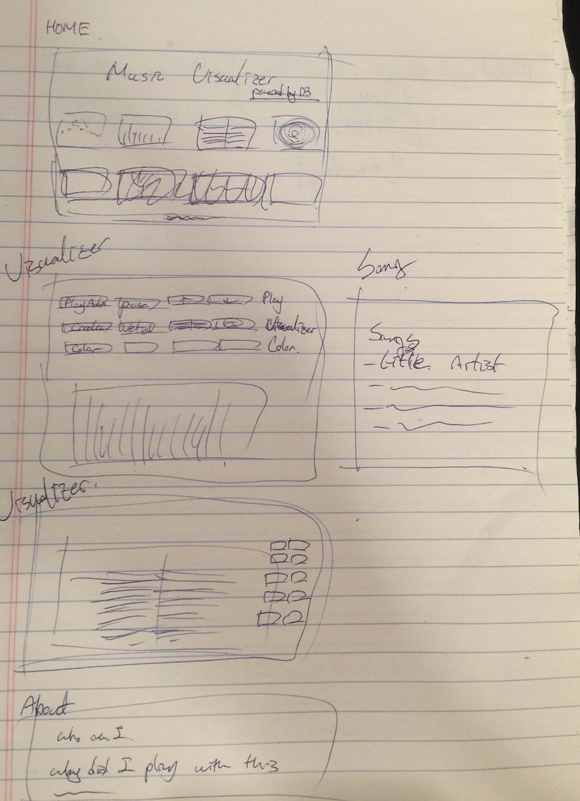
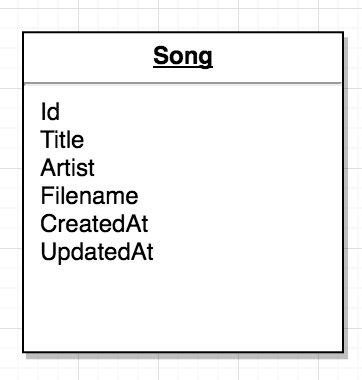

# Music Visualizer

##Overview:
A web based application to visualize your favorite music. Built with MongoDB, ExpressJS, AngularJS, and NodeJS. 

Demo: <https://music-visualizer.herokuapp.com/>

## Features:
- Choose a song of your favor.

- Load different visualizers.
	- Four modes available: Bar, circle, radial, hexagon
- Select your color theme.
- Blast off your music.

## Planning:

Plan: 

Model: 

## Bottle Necks:

**Web Audio API & D3.js:**
Understanding how to manipulate the frequency data of the music captured by the Web Audio API and inserting that frequency data back into the D3 chart/template so I could acheive the right visual effect.

**Modal UI Routing:**
I wanted the song list to be displayed on a modal rather than being displayed on the main page where the visualizer was loaded. Passing data between server  <-> main page <-> modal was very difficult. Thanks to bootstrap UI routing with great documentations and examples to show how to link up the controllers.

## Technologies Used:
- HTML5, CSS3, JavaScript, jQuery, MongoDB, ExpressJS, NodeJS, AngularJS, Bootstrap, Heroku, mLaB, Web Audio API, D3.js, UI Bootstrap

- Design: Draw.io

- Text Editor: Sublime 3

- Project Management: Trello

## Project Links:

[Trello](https://trello.com/b/01ZrbqZc/music-visualizer`)

[GitHub](https://github.com/H4RU87/Music-Visualizer)

## Future Features:

- Upload music your own music

- Connect with music streaming API (ex. Beatport)

- Create more color theme

- Create more visualizer effects

- Add responsive keyboard to control the app

- Style my control panel with icons

## Legal Disclaimer
I do not own any of the songs loaded up on my website.